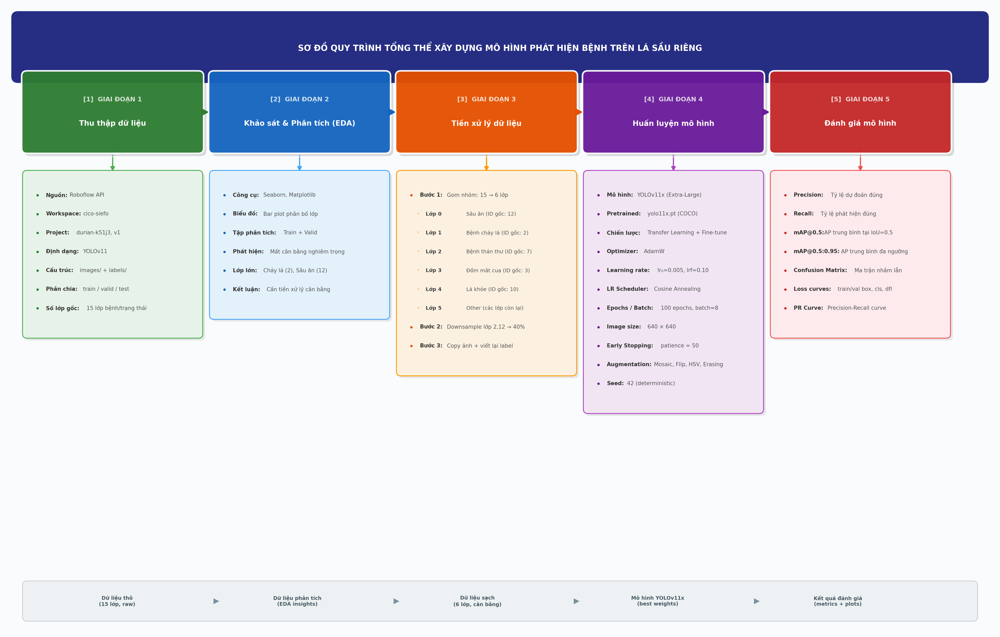

# CHƯƠNG 3. NỘI DUNG TIỂU LUẬN (CÁCH TIẾP CẬN VÀ PHƯƠNG PHÁP XÂY DỰNG)

Chương này trình bày chi tiết cách tiếp cận và các bước xây dựng mô hình phát hiện bệnh trên lá sầu riêng. Toàn bộ quy trình được thiết kế theo phương pháp luận thực nghiệm, bắt đầu từ việc thu thập dữ liệu thô, phân tích khám phá dữ liệu, tiền xử lý và chuẩn hóa, cho đến huấn luyện mô hình Học sâu (Deep Learning — DL). Mỗi bước trong quy trình đều có vai trò quan trọng trong việc đảm bảo chất lượng và độ tin cậy của mô hình cuối cùng.

## 3.1. Quy trình tổng thể

Quy trình xây dựng mô hình phát hiện bệnh trên lá sầu riêng trong nghiên cứu này được tổ chức thành năm giai đoạn chính, thực hiện tuần tự theo dạng đường ống (pipeline). Mỗi giai đoạn đóng vai trò là đầu vào cho giai đoạn tiếp theo, đảm bảo tính nhất quán và khả năng tái lập của toàn bộ thí nghiệm.

Sơ đồ pipeline tổng thể được mô tả trong Hình 3.1.

**Thứ nhất, giai đoạn thu thập dữ liệu** tập trung vào việc tải bộ dữ liệu hình ảnh lá sầu riêng đã được gán nhãn từ nền tảng Roboflow thông qua giao diện lập trình ứng dụng (Application Programming Interface — API). Dữ liệu được tải về ở định dạng tương thích với kiến trúc YOLOv11, bao gồm hình ảnh và nhãn tương ứng cho 15 lớp bệnh/trạng thái ban đầu.

**Thứ hai, giai đoạn khảo sát và phân tích dữ liệu** (Exploratory Data Analysis — EDA) thực hiện trực quan hóa phân bố các lớp trên tập huấn luyện và tập kiểm định, từ đó nhận diện vấn đề mất cân bằng dữ liệu (data imbalance) giữa các lớp. Kết quả phân tích ở giai đoạn này là cơ sở quan trọng để đưa ra quyết định tiền xử lý phù hợp.

**Thứ ba, giai đoạn tiền xử lý dữ liệu** bao gồm hai bước chính: gom nhóm 15 lớp ban đầu thành 6 lớp chính dựa trên tần suất xuất hiện và ý nghĩa thực tiễn, sau đó thực hiện giảm mẫu (downsampling) các lớp chiếm ưu thế nhằm giảm thiên lệch (bias) trong quá trình huấn luyện.

**Thứ tư, giai đoạn huấn luyện mô hình** sử dụng kiến trúc YOLOv11x với trọng số huấn luyện trước (pretrained weights) được tinh chỉnh (fine-tuning) trên bộ dữ liệu đã qua tiền xử lý. Các siêu tham số (hyperparameters) được lựa chọn và cấu hình cẩn thận nhằm tối ưu hóa hiệu suất phát hiện.

**Thứ năm, giai đoạn đánh giá mô hình** sử dụng các chỉ số tiêu chuẩn trong bài toán phát hiện đối tượng như Độ chính xác (Precision), Độ nhạy (Recall) và Độ chính xác trung bình (mean Average Precision — mAP) để đo lường hiệu quả của mô hình trên tập kiểm định.

## 3.2. Thu thập dữ liệu

### 3.2.1. Nguồn dữ liệu

Bộ dữ liệu sử dụng trong nghiên cứu này được thu thập từ nền tảng Roboflow — một hệ sinh thái quản lý và chia sẻ dữ liệu hình ảnh phục vụ các bài toán thị giác máy tính (Computer Vision — CV). Cụ thể, dữ liệu được tải về thông qua Roboflow API với các thông số: workspace `cico-siefo`, project `durian-k51j3`, phiên bản 1. Việc sử dụng API cho phép tự động hóa quá trình tải dữ liệu, đảm bảo tính nhất quán và khả năng tái lập của thí nghiệm.

Bộ dữ liệu bao gồm các hình ảnh chụp lá sầu riêng trong nhiều điều kiện khác nhau, mỗi hình ảnh đã được gán nhãn (annotated) bởi cộng đồng người dùng trên nền tảng Roboflow. Nhãn bao gồm tọa độ hộp giới hạn (bounding box) và lớp bệnh tương ứng, phù hợp với bài toán phát hiện đối tượng (Object Detection).

### 3.2.2. Cấu trúc dữ liệu

Dữ liệu được tải về ở định dạng YOLOv11, tuân theo cấu trúc thư mục chuẩn của framework Ultralytics. Cấu trúc này bao gồm hai thư mục chính cho mỗi tập con (split): thư mục `images/` chứa các tệp hình ảnh định dạng JPEG, và thư mục `labels/` chứa các tệp nhãn định dạng văn bản (.txt) tương ứng. Mỗi tệp nhãn có cùng tên với tệp hình ảnh và chứa thông tin về các đối tượng trong ảnh theo định dạng: `<class_id> <x_center> <y_center> <width> <height>`, trong đó tọa độ được chuẩn hóa trong khoảng [0, 1].

Bộ dữ liệu được chia thành ba tập con theo quy ước chuẩn trong học máy:

| Tập dữ liệu | Mục đích |
|---|---|
| Train | Dùng để huấn luyện mô hình |
| Valid (Validation) | Dùng để kiểm định trong quá trình huấn luyện, theo dõi overfitting |
| Test | Dùng để đánh giá cuối cùng trên dữ liệu chưa từng được mô hình tiếp xúc |

### 3.2.3. Mô tả các lớp bệnh ban đầu

Bộ dữ liệu gốc bao gồm 15 lớp bệnh và trạng thái khác nhau trên lá sầu riêng. Bảng dưới đây liệt kê đầy đủ các lớp cùng với mã định danh (ID) tương ứng trong tệp nhãn:

| ID | Tên lớp (tiếng Việt) |
|---|---|
| 0 | Bệnh bọ trĩ |
| 1 | Bệnh phấn trắng |
| 2 | Bệnh cháy lá |
| 3 | Bệnh đốm mắt cua |
| 4 | Bệnh gỉ sắt |
| 5 | Bệnh lá vàng |
| 6 | Bệnh tảo đỏ |
| 7 | Bệnh thán thư |
| 8 | Đốm lá do nấm |
| 9 | Đốm sinh lý nhẹ |
| 10 | Lá khỏe bình thường |
| 11 | Sâu vẽ bùa |
| 12 | Sâu ăn |
| 13 | Vàng sinh lý |
| 14 | Vàng thiếu magie |

Sự đa dạng của 15 lớp bệnh phản ánh thực tế phức tạp của các vấn đề sức khỏe trên lá sầu riêng. Tuy nhiên, số lượng lớp lớn kết hợp với sự phân bố không đồng đều giữa các lớp đặt ra thách thức đáng kể cho quá trình huấn luyện mô hình. Vấn đề này được phân tích chi tiết trong mục 3.3 và được xử lý thông qua chiến lược gom nhóm lớp tại mục 3.4.

## 3.3. Phân tích và khảo sát dữ liệu (EDA)

### 3.3.1. Trực quan hóa phân bố lớp

Để hiểu rõ đặc điểm của bộ dữ liệu trước khi huấn luyện, nghiên cứu thực hiện phân tích khám phá dữ liệu (Exploratory Data Analysis — EDA) thông qua việc trực quan hóa phân bố số lượng mẫu của từng lớp. Biểu đồ cột (bar plot) được xây dựng bằng thư viện Seaborn cho cả tập huấn luyện (train) và tập kiểm định (valid), cho phép so sánh trực quan mức độ đại diện của mỗi lớp bệnh trong dữ liệu.

Phương pháp thực hiện bao gồm: đọc toàn bộ tệp nhãn trong từng tập con, trích xuất mã lớp (class ID) từ mỗi dòng trong tệp nhãn, đếm tần suất xuất hiện của từng lớp, sau đó biểu diễn kết quả dưới dạng biểu đồ cột với trục hoành là tên lớp bệnh và trục tung là số lượng mẫu. Việc trực quan hóa phân bố lớp (Class Distribution) giúp nhận diện nhanh chóng các lớp chiếm ưu thế và các lớp thiểu số trong bộ dữ liệu.

### 3.3.2. Nhận xét về sự mất cân bằng dữ liệu

Kết quả phân tích phân bố lớp cho thấy bộ dữ liệu tồn tại vấn đề mất cân bằng dữ liệu nghiêm trọng (severe data imbalance). Một số lớp như bệnh cháy lá (ID 2) và sâu ăn (ID 12) chiếm tỷ trọng lớn đáng kể so với các lớp còn lại. Ngược lại, nhiều lớp bệnh khác chỉ có số lượng mẫu rất hạn chế, không đủ để mô hình học được các đặc trưng phân biệt một cách hiệu quả.

Sự mất cân bằng dữ liệu là một thách thức phổ biến trong các bài toán phân loại và phát hiện đối tượng, đặc biệt trong lĩnh vực nông nghiệp nơi một số loại bệnh xuất hiện phổ biến hơn các loại khác [1]. Khi dữ liệu mất cân bằng, mô hình có xu hướng thiên lệch về phía các lớp đa số (majority classes), dẫn đến hiệu suất kém trên các lớp thiểu số (minority classes). Vấn đề này đòi hỏi các biện pháp tiền xử lý phù hợp, được trình bày chi tiết tại mục 3.4.

## 3.4. Tiền xử lý dữ liệu

### 3.4.1. Gom nhóm lớp (Class Refactoring)

Dựa trên kết quả phân tích EDA ở mục 3.3, nghiên cứu quyết định thực hiện gom nhóm (refactoring) 15 lớp ban đầu thành 6 lớp chính. Quyết định này dựa trên hai tiêu chí: **thứ nhất**, tần suất xuất hiện — chỉ giữ lại các lớp có đủ số lượng mẫu để mô hình có thể học được đặc trưng đại diện; **thứ hai**, ý nghĩa thực tiễn — ưu tiên giữ lại các lớp bệnh phổ biến và có tác động kinh tế lớn đối với người trồng sầu riêng. Các lớp bệnh ít mẫu hoặc có triệu chứng tương tự nhau được gom chung vào một nhóm.

Bảng ánh xạ (mapping) từ lớp gốc sang lớp mới được trình bày dưới đây:

| Lớp mới (ID) | Tên lớp | ID gốc | Lý do giữ lại/gom nhóm |
|---|---|---|---|
| 0 | Sâu ăn (sau-an) | 12 | Tần suất cao, thiệt hại kinh tế lớn |
| 1 | Bệnh cháy lá (benh-chay-la) | 2 | Tần suất cao nhất, bệnh phổ biến |
| 2 | Bệnh thán thư (benh-than-thu) | 7 | Bệnh quan trọng, đủ mẫu |
| 3 | Bệnh đốm mắt cua (benh-dom-mat-cua) | 3 | Bệnh đặc trưng, đủ mẫu |
| 4 | Lá khỏe bình thường (la-khoe) | 10 | Lớp tham chiếu (reference class) |
| 5 | Nhóm các bệnh còn lại (other) | 0, 1, 4, 5, 6, 8, 9, 11, 13, 14 | Gom các lớp ít mẫu |

Quá trình gom nhóm được thực hiện bằng cách đọc từng tệp nhãn, thay thế mã lớp gốc bằng mã lớp mới theo bảng ánh xạ, sau đó ghi lại tệp nhãn với các ID đã được cập nhật. Hình ảnh gốc được sao chép nguyên vẹn sang thư mục dữ liệu mới, chỉ có nội dung tệp nhãn thay đổi. Tệp cấu hình `dataset.yaml` mới được tạo với 6 lớp: `sau-an`, `benh-chay-la`, `benh-than-thu`, `benh-dom-mat-cua`, `la-khoe`, và `other`.

### 3.4.2. Cân bằng dữ liệu bằng phương pháp giảm mẫu (Downsampling)

Sau khi gom nhóm, sự mất cân bằng dữ liệu vẫn tồn tại do hai lớp chiếm ưu thế là bệnh cháy lá (ID gốc 2) và sâu ăn (ID gốc 12) có số lượng mẫu lớn hơn đáng kể so với các lớp còn lại. Để giải quyết vấn đề này, nghiên cứu áp dụng phương pháp giảm mẫu ngẫu nhiên (random downsampling) trên tập huấn luyện.

Chiến lược giảm mẫu được triển khai như sau: với mỗi hình ảnh trong tập huấn luyện, hệ thống kiểm tra tệp nhãn tương ứng để xác định các lớp đối tượng có trong ảnh đó. Nếu hình ảnh chứa ít nhất một đối tượng thuộc lớp chiếm ưu thế (lớp 2 — bệnh cháy lá hoặc lớp 12 — sâu ăn), hình ảnh đó được đánh dấu là "thuộc nhóm lớp lớn". Sau khi xác định toàn bộ hình ảnh thuộc nhóm này, chỉ giữ lại ngẫu nhiên 40% (`keep_ratio = 0.4`) trong số đó. Các hình ảnh thuộc các lớp khác được giữ lại toàn bộ mà không bị ảnh hưởng.

Thuật toán giảm mẫu được mô tả theo các bước:

1. Duyệt qua toàn bộ hình ảnh trong tập huấn luyện, đọc tệp nhãn tương ứng.
2. Xác định tập hợp các hình ảnh chứa đối tượng thuộc lớp chiếm ưu thế (`target_classes = [2, 12]`).
3. Lấy mẫu ngẫu nhiên (random sampling) 40% từ tập hợp trên để giữ lại.
4. Sao chép hình ảnh và tệp nhãn đủ điều kiện sang thư mục dữ liệu mới (`durian-1_balanced`).
5. Các hình ảnh không chứa lớp chiếm ưu thế được sao chép toàn bộ.

Phương pháp giảm mẫu được lựa chọn thay vì tăng mẫu (oversampling) hoặc tăng cường dữ liệu (data augmentation) cho các lớp thiểu số vì tính đơn giản trong triển khai và hiệu quả trong việc giảm thiên lệch mà không làm tăng kích thước bộ dữ liệu. Ngoài ra, YOLOv11 đã tích hợp sẵn các kỹ thuật tăng cường dữ liệu như Mosaic và các phép biến đổi hình ảnh trong quá trình huấn luyện, do đó việc giảm mẫu kết hợp với tăng cường dữ liệu tích hợp tạo ra chiến lược cân bằng hiệu quả.

### 3.4.3. Sao chép và viết lại dữ liệu

Toàn bộ quá trình tiền xử lý tạo ra một bộ dữ liệu mới với cấu trúc thư mục tương tự bộ gốc nhưng với hai thay đổi quan trọng. **Thứ nhất**, tệp nhãn được viết lại với mã lớp mới theo bảng ánh xạ 6 lớp thay vì 15 lớp ban đầu. **Thứ hai**, trên tập huấn luyện, số lượng hình ảnh chứa lớp chiếm ưu thế được giảm xuống còn 40%, trong khi tập kiểm định (valid) và tập kiểm thử (test) được giữ nguyên để đảm bảo tính khách quan trong đánh giá.

Dữ liệu sau tiền xử lý được tổ chức theo cấu trúc phù hợp với framework Ultralytics, với tệp cấu hình `dataset.yaml` mới chỉ định đường dẫn đến tập huấn luyện đã cân bằng (`balanced/train/images`), tập kiểm định (`refactored/valid/images`) và tập kiểm thử (`refactored/test/images`). Tệp cấu hình cũng khai báo số lượng lớp `nc: 6` cùng danh sách tên lớp tương ứng.

## 3.5. Huấn luyện mô hình

### 3.5.1. Mô hình sử dụng

Nghiên cứu sử dụng mô hình YOLOv11x — phiên bản lớn nhất (extra-large) trong họ kiến trúc YOLOv11 do Ultralytics phát triển. YOLOv11x được lựa chọn vì có số lượng tham số lớn nhất trong các biến thể YOLOv11 (nano, small, medium, large, extra-large), cho phép mô hình học được các đặc trưng phức tạp và tinh tế hơn từ dữ liệu hình ảnh lá sầu riêng. Mô hình được khởi tạo từ trọng số huấn luyện trước (`yolo11x.pt`) trên bộ dữ liệu COCO [2], sau đó được tinh chỉnh (fine-tuning) trên bộ dữ liệu bệnh lá sầu riêng đã qua tiền xử lý.

Chiến lược Học chuyển giao (Transfer Learning) được áp dụng trong nghiên cứu này mang lại nhiều lợi ích quan trọng. Mô hình huấn luyện trước đã học được các đặc trưng thị giác tổng quát như cạnh, góc, kết cấu từ tập dữ liệu lớn COCO. Khi tinh chỉnh trên dữ liệu lá sầu riêng, các lớp đặc trưng cấp thấp (low-level features) này được tái sử dụng, trong khi các lớp cấp cao (high-level features) được điều chỉnh để nhận diện các mẫu bệnh đặc thù. Điều này giúp giảm đáng kể thời gian huấn luyện và cải thiện hiệu suất so với việc huấn luyện từ đầu (training from scratch), đặc biệt khi bộ dữ liệu có kích thước hạn chế.

### 3.5.2. Cấu hình huấn luyện

Các siêu tham số (hyperparameters) được lựa chọn cẩn thận nhằm cân bằng giữa tốc độ hội tụ và chất lượng mô hình. Bảng dưới đây tổng hợp các tham số chính được sử dụng trong quá trình huấn luyện:

| Tham số | Giá trị | Mô tả |
|---|---|---|
| Kích thước batch (batch size) | 8 | Số lượng mẫu trong mỗi lần cập nhật trọng số |
| Số vòng lặp (epochs) | 100 | Số lần duyệt qua toàn bộ tập huấn luyện |
| Kích thước ảnh đầu vào (image size) | 640 × 640 | Kích thước chuẩn hóa ảnh trước khi đưa vào mô hình |
| Bộ tối ưu (optimizer) | AdamW | Biến thể Adam với kỹ thuật phân rã trọng số tách biệt (decoupled weight decay) |
| Tốc độ học ban đầu (lr0) | 0.005 | Tốc độ học tại thời điểm bắt đầu huấn luyện |
| Tốc độ học cuối (lrf) | 0.10 | Hệ số tốc độ học tại epoch cuối (lr_final = lr0 × lrf) |
| Phân rã trọng số (weight decay) | 0.0005 | Hệ số chính quy hóa L2 nhằm giảm quá khớp (overfitting) |
| Số epoch khởi động (warmup epochs) | 3 | Số epoch tăng dần tốc độ học từ giá trị thấp |
| Bộ lập lịch tốc độ học (LR scheduler) | Cosine Annealing | Giảm tốc độ học theo hàm cosine (`cos_lr: true`) |
| Dừng sớm (early stopping patience) | 50 | Dừng huấn luyện nếu mAP không cải thiện sau 50 epoch |
| Hạt giống ngẫu nhiên (seed) | 42 | Đảm bảo tính tái lập của thí nghiệm |
| Huấn luyện xác định (deterministic) | true | Kết hợp với seed để đảm bảo kết quả tái lập |
| Độ chính xác hỗn hợp (AMP) | true | Sử dụng Automatic Mixed Precision để tăng tốc huấn luyện |

**Bộ tối ưu AdamW** được lựa chọn thay vì SGD truyền thống vì khả năng hội tụ nhanh hơn trên bộ dữ liệu có kích thước vừa và nhỏ. AdamW cải tiến so với Adam gốc ở chỗ tách biệt phần phân rã trọng số (weight decay) khỏi phần cập nhật gradient, giúp quá trình chính quy hóa (regularization) hoạt động hiệu quả hơn [3].

**Bộ lập lịch Cosine Annealing** giảm tốc độ học theo hàm cosine từ giá trị ban đầu `lr0 = 0.005` xuống giá trị cuối `lr0 × lrf = 0.0005` qua 100 epoch. So với phương pháp giảm tốc độ học theo bậc thang (step decay), Cosine Annealing tạo ra quá trình giảm mượt mà hơn, giúp mô hình tránh rơi vào các cực tiểu địa phương (local minima) và hội tụ tốt hơn [4].

**Cơ chế dừng sớm (Early Stopping)** với ngưỡng kiên nhẫn (patience) là 50 epoch đóng vai trò bảo vệ mô hình khỏi hiện tượng quá khớp. Nếu chỉ số mAP trên tập kiểm định không cải thiện sau 50 epoch liên tiếp, quá trình huấn luyện sẽ tự động dừng lại và lưu trọng số tốt nhất (best weights). Trong thí nghiệm này, mô hình đã hoàn thành đủ 100 epoch mà không kích hoạt dừng sớm, cho thấy mô hình vẫn tiếp tục cải thiện trong suốt quá trình huấn luyện.

Ngoài ra, YOLOv11 tích hợp sẵn các kỹ thuật tăng cường dữ liệu (data augmentation) trong quá trình huấn luyện, bao gồm: Mosaic (kết hợp 4 hình ảnh thành 1, `mosaic: 1.0`), lật ngang ngẫu nhiên (`fliplr: 0.5`), biến đổi không gian màu HSV (`hsv_h: 0.015, hsv_s: 0.7, hsv_v: 0.4`), co giãn ngẫu nhiên (`scale: 0.5`), và xóa ngẫu nhiên (`erasing: 0.4`). Các kỹ thuật này giúp tăng tính đa dạng của dữ liệu huấn luyện mà không cần thu thập thêm mẫu mới.

### 3.5.3. Phần cứng sử dụng

Quá trình huấn luyện được thực hiện trên thiết bị Apple Silicon sử dụng backend Metal Performance Shaders (MPS), là framework tính toán GPU do Apple phát triển cho các dòng chip M-series. Tham số `device: mps` trong cấu hình huấn luyện cho phép tận dụng khả năng tính toán song song của GPU tích hợp, giúp tăng tốc đáng kể quá trình huấn luyện so với chỉ sử dụng CPU.

Tổng thời gian huấn luyện 100 epoch là khoảng 6.464 giây (xấp xỉ 1 giờ 48 phút), với thời gian trung bình mỗi epoch khoảng 64 giây. Kỹ thuật Automatic Mixed Precision (AMP) được kích hoạt (`amp: true`) nhằm giảm lượng bộ nhớ sử dụng và tăng tốc tính toán bằng cách kết hợp các phép toán ở độ chính xác 32-bit (FP32) và 16-bit (FP16) một cách tự động.

---

## Tài liệu tham khảo

[1] M. Buda, A. Maki, and M. A. Mazurowski, "A systematic study of the class imbalance problem in convolutional neural networks," _Neural Networks_, vol. 106, pp. 249–259, 2018.

[2] T.-Y. Lin, M. Maire, S. Belongie, J. Hays, P. Perona, D. Ramanan, P. Dollár, and C. L. Zitnick, "Microsoft COCO: Common Objects in Context," _Proceedings of the European Conference on Computer Vision (ECCV)_, pp. 740–755, 2014.

[3] I. Loshchilov and F. Hutter, "Decoupled Weight Decay Regularization," _Proceedings of the International Conference on Learning Representations (ICLR)_, 2019.

[4] I. Loshchilov and F. Hutter, "SGDR: Stochastic Gradient Descent with Warm Restarts," _Proceedings of the International Conference on Learning Representations (ICLR)_, 2017.
